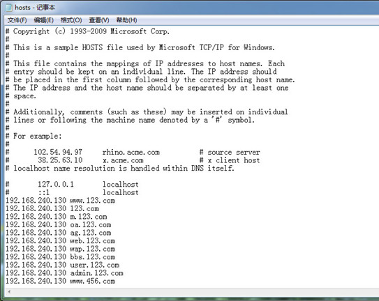

# Host文件修改工具
## 简述：
Host文件修改工具，可以非常直观的进行修改Hosts文件。 
## Hosts文件主要可以实现以下几个功能：
一、加快域名解析，可以在Hosts中配置域名和IP的映射关系，让域名指定某个IP访问，特别是某个网站不能访问了，我们重新指向另一个IP就能实现访问；

二、屏蔽网站，让指定域名解析到本地IP从而实现无法访问；

上述两个功能也是我们最常用的。

## 软件截图：

- 
